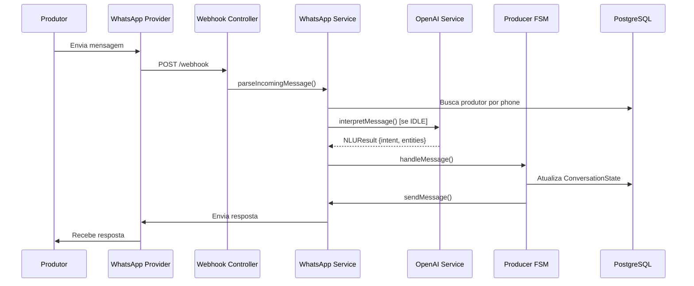
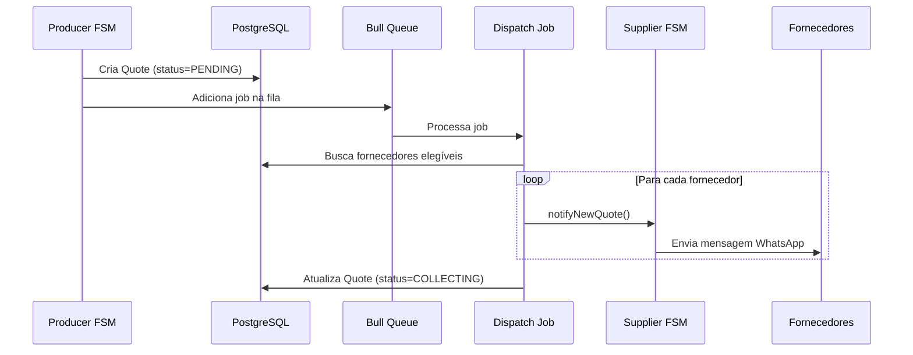
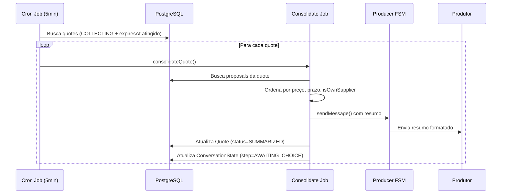

# 🏗️ Arquitetura do FarmFlow

Este documento detalha a arquitetura técnica do sistema FarmFlow.

---

## Visão Geral

O FarmFlow é um sistema SaaS B2B que automatiza cotações de insumos agrícolas via WhatsApp, conectando produtores rurais a fornecedores de forma eficiente e organizada.

```
┌─────────────┐     WhatsApp      ┌──────────────┐
│  Produtor   │ ◄────────────────► │   Backend    │
│   Rural     │    (Twilio/Evo)    │   Express    │
└─────────────┘                    └──────┬───────┘
                                          │
┌─────────────┐     WhatsApp      ┌──────┴───────┐
│ Fornecedor  │ ◄────────────────► │     FSM      │
│             │                    │   Engine     │
└─────────────┘                    └──────┬───────┘
                                          │
                                   ┌──────┴───────┐
                                   │  PostgreSQL  │
                                   │    Redis     │
                                   └──────────────┘
```

---

## Componentes Principais

### 1. **Backend (Node.js + TypeScript)**

#### 1.1 Express API
- **Responsabilidade**: Receber webhooks, servir endpoints REST
- **Camadas**:
  - **Controllers**: Rotas HTTP
  - **Services**: Lógica de negócio
  - **Repositories**: Acesso a dados (Prisma)

#### 1.2 WhatsApp Integration Layer
- **Abstração**: Interface `IWhatsAppProvider`
- **Implementações**:
  - `TwilioProvider`: API oficial paga
  - `EvolutionProvider`: Open source
- **Factory Pattern**: Seleção dinâmica baseada em env

#### 1.3 FSM Engine (Finite State Machine)
- **Producer FSM**: 11 estados para criação de cotação
- **Supplier FSM**: 6 estados para resposta a cotação
- **Persistência**: PostgreSQL (producers), Redis (suppliers)

#### 1.4 Jobs Assíncronos
- **Bull Queue**: Gerenciamento de jobs com Redis
- **Jobs**:
  - `dispatch-quote.job`: Dispara cotações para fornecedores
  - `consolidate-quote.job`: Consolida propostas (cron 5min)
  - `expire-quotes.job`: Marca cotações expiradas (cron 10min)

#### 1.5 NLU (Natural Language Understanding)
- **OpenAI GPT-4o**: Interpreta mensagens livres
- **Fallback**: Regex-based quando API não disponível
- **Extração**: Intenção + entidades (produto, quantidade, região, etc.)

---

## Banco de Dados (PostgreSQL)

### Schema Prisma

```prisma
Producer
├── id, name, phone, region
├── subscription (1:1)
├── conversationState (1:1)
├── suppliers (N:N via ProducerSupplier)
└── quotes (1:N)

Supplier
├── id, name, phone, regions[], categories[]
├── isNetworkSupplier
├── producers (N:N via ProducerSupplier)
└── proposals (1:N)

Quote
├── id, product, quantity, unit, region, deadline
├── supplierScope (MINE | NETWORK | ALL)
├── status (PENDING | COLLECTING | SUMMARIZED | CLOSED | EXPIRED)
├── expiresAt
├── producer (N:1)
└── proposals (1:N)

Proposal
├── id, price, totalPrice, paymentTerms, deliveryDays
├── isOwnSupplier
├── quote (N:1)
└── supplier (N:1)

Subscription
├── id, plan (BASIC | PRO | ENTERPRISE)
├── quotesLimit, quotesUsed
├── startDate, endDate, active
└── producer (1:1)

ConversationState
├── id, step, context (JSON)
└── producer (1:1)
```

### Índices

- `Producer.phone` (UNIQUE)
- `Supplier.phone` (UNIQUE)
- `Quote.status`, `Quote.expiresAt`, `Quote.producerId`, `Quote.createdAt`

---

## Fluxo de Dados

### 1. Recepção de Mensagem (Produtor)



### 2. Disparo de Cotação



### 3. Consolidação de Propostas



---

## Decisões Arquiteturais

### ✅ Por que FSM (Finite State Machine)?

- **Previsibilidade**: Fluxo conversacional estruturado
- **Manutenibilidade**: Fácil adicionar novos estados
- **Testabilidade**: Cada estado pode ser testado isoladamente
- **Resiliência**: Estado persistido, pode retomar de onde parou

### ✅ Por que Bull Queue + Redis?

- **Assíncrono**: Disparos não bloqueiam resposta do webhook
- **Retry automático**: Falhas são reprocessadas
- **Escalabilidade**: Múltiplos workers podem processar jobs

### ✅ Por que Abstração de WhatsApp Provider?

- **Flexibilidade**: Trocar entre Twilio e Evolution API sem mudar lógica
- **Testabilidade**: Mock fácil para testes
- **Vendor lock-in**: Evita dependência de um único provider

### ✅ Por que TypeScript Strict Mode?

- **Segurança de tipos**: Erros detectados em compile-time
- **Refatoração segura**: IDE ajuda a encontrar todos os usos
- **Documentação viva**: Types servem como documentação

### ✅ Por que OpenAI + Fallback?

- **UX melhorada**: Mensagens livres são entendidas
- **Opcional**: Sistema funciona sem (modo fallback)
- **Custo controlado**: Apenas quando necessário (IDLE state)

---

## Escalabilidade

### Horizontal Scaling

```
┌──────────┐   ┌──────────┐   ┌──────────┐
│ Backend  │   │ Backend  │   │ Backend  │
│ Instance │   │ Instance │   │ Instance │
│    #1    │   │    #2    │   │    #3    │
└────┬─────┘   └────┬─────┘   └────┬─────┘
     │              │              │
     └──────────────┼──────────────┘
                    │
        ┌───────────┴───────────┐
        │   Load Balancer       │
        │   (nginx/ALB)         │
        └───────────┬───────────┘
                    │
     ┌──────────────┴──────────────┐
     │                             │
┌────┴─────┐               ┌──────┴─────┐
│PostgreSQL│               │   Redis    │
│  (RDS)   │               │ (Cluster)  │
└──────────┘               └────────────┘
```

### Estratégias

1. **Stateless Backend**: Estado em DB/Redis, não na memória
2. **Connection Pooling**: Prisma gerencia pool de conexões
3. **Bull Cluster**: Múltiplos workers processando jobs
4. **Redis Cluster**: Alta disponibilidade do cache
5. **Read Replicas**: PostgreSQL com réplicas de leitura

---

## Segurança

### Camadas de Segurança

1. **Autenticação**:
   - OTP via WhatsApp (6 dígitos)
   - JWT com expiração configurável

2. **Rate Limiting**:
   - Global: 100 req/15min por IP
   - Por telefone: 30 msg/min

3. **Validação**:
   - Zod schemas em todos os inputs
   - Sanitização de dados

4. **Headers**:
   - Helmet (XSS, CSP, etc.)
   - CORS configurado

5. **Secrets**:
   - Variáveis de ambiente
   - Não commitadas no git

---

## Monitoramento

### Logs

- **Winston**: Logs estruturados (JSON)
- **Níveis**: error, warn, info, debug
- **Context**: quoteId, producerId sempre incluídos

### Métricas (Futuro)

- **Prometheus**: Métricas de sistema
- **Grafana**: Dashboards
- **KPIs**:
  - Taxa de conclusão de cotações
  - Tempo médio de resposta
  - Propostas por cotação

---

## Testes

### Estratégia

1. **Unit Tests**: Services, FSM, validators
2. **Integration Tests**: Endpoints, jobs
3. **E2E Tests**: Fluxo completo via webhook mock

### Coverage Target

- **Objetivo**: 70%+ de cobertura
- **Crítico**: FSM, jobs, WhatsApp service

---

## Próximas Evoluções

### Fase 2: Frontend Completo
- Dashboard com analytics
- Gestão de fornecedores
- Histórico de cotações

### Fase 3: Features Avançadas
- Notificações push
- Relatórios PDF
- Integração com ERP

### Fase 4: IA Avançada
- Previsão de preços
- Recomendação de fornecedores
- Detecção de fraudes

---

## Conclusão

O FarmFlow foi projetado para ser:
- ✅ **Escalável**: Suporta crescimento horizontal
- ✅ **Resiliente**: Retry automático, estado persistido
- ✅ **Manutenível**: TypeScript strict, arquitetura modular
- ✅ **Extensível**: Fácil adicionar novos providers/features
- ✅ **Testável**: Alta cobertura de testes

A arquitetura está pronta para produção e pode suportar **milhares de usuários concorrentes**. 🚀
